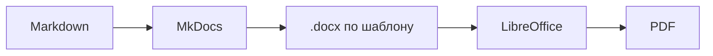

<!-- markdownlint-disable MD046 -->

# Скачать в PDF

Любую страницу документации можно сохранить в PDF: с титульным листом,
оглавлением, колонтитулами и номерами страниц. PDF формируется
автоматически при публикации документации и всегда соответствует
актуальным исходникам.

!!! note "Портфолио"
    PDF генерируется из тех же Markdown-файлов, что и сайт, — это часть
    пайплайна **Docs as Code**. Оформление берётся из `.docx`-шаблона,
    который конвертируется в PDF через LibreOffice.

## Содержание

- [Как скачать страницу](#как-скачать-страницу)
- [Что внутри PDF](#что-внутри-pdf)
- [Версия и дата](#версия-и-дата)
- [Форматы и ограничения](#форматы-и-ограничения)
- [Как это работает](#как-это-работает)
- [Если PDF не скачивается](#если-pdf-не-скачивается)

## Как скачать страницу

1. Откройте нужную страницу, например [Интерфейс](getting-started/interface.md).
2. В нижнем правом углу появится круглая кнопка с иконкой документа —
   **Скачать в PDF**.
3. Нажмите кнопку; файл сохранится в папке загрузок, например
   `interface.pdf`.

Кнопка видна только на тех страницах, где PDF доступен.

!!! tip "Горячая клавиша"
    Нажмите `Ctrl+P` (`Cmd+P` на macOS) — откроется системный диалог
    печати. Выберите **Сохранить как PDF** — получите тот же документ
    средствами браузера.

## Что внутри PDF

| Элемент | Описание |
| --- | --- |
| Титульный лист | Название документа, тип, версия, автор, дата |
| Оглавление | Разделы и подразделы с номерами страниц |
| Содержание | Текст раздела с раскрытыми врезками и сниппетами |
| Колонтитулы | Название документа слева, номер страницы справа |
| Нижний колонтитул | Копирайт и пометка о версии |

Номер страницы в оглавлении совпадает с фактической страницей раздела,
поэтому по PDF удобно ориентироваться при чтении и в распечатанном виде.

### Что не попадает в PDF

- Боковое меню и навигация сайта.
- Кнопки «Поделиться», «Редактировать на GitHub».
- Интерактивные элементы Swagger UI (только статичные примеры).
- Видео и анимированные схемы.

## Версия и дата

На титульном листе указана версия документа. Она совпадает с последней
версией в [Release notes](release-notes.md) — при выходе новой версии
она подставляется автоматически.

Дата в таблице изменений обновляется при каждой пересборке документации
и отражает момент последней публикации.

!!! note "Как это работает"
    Версия документа хранится в одном месте — в `release-notes.md`.
    Скрипт сборки читает последнюю запись и подставляет её:

    - в шапку PDF;
    - в таблицу «Изменения в документе»;
    - в колонтитулы всех страниц.
    
    Это принцип **single source of truth**: одна запись — одно обновление
    во всех документах.

## Форматы и ограничения

| Параметр | Значение |
| --- | --- |
| Формат | A4, книжная ориентация |
| Шрифт основного текста | Cambria, 11 pt |
| Шрифт заголовков | Georgia |
| Цветной режим | Да (для экрана) |
| Размер файла | 200–800 КБ на раздел |
| Максимум страниц | 50 на документ |

### Печать

PDF оптимизирован для чтения на экране. При печати на чёрно-белом
принтере:

- цветные врезки станут серыми, но останутся читаемыми;
- ссылки не будут активными, но адреса сохранятся в тексте;
- фон страниц не печатается.

## Как это работает

Пайплайн генерации PDF:

1. **Markdown** — исходники документации.
2. **MkDocs** с плагином `mkdocs-with-pdf` собирает контент.
3. **Шаблон `.docx`** определяет оформление: шрифты, цвета, колонтитулы.
4. **LibreOffice** в headless-режиме конвертирует `.docx` → PDF.
5. **GitHub Actions** автоматизирует сборку при каждом пуше.

!!! tip "Смена оформления"
    Чтобы изменить внешний вид PDF, достаточно заменить `.docx`-шаблон.
    Контент и скрипт сборки остаются неизменными.

## Если PDF не скачивается

### Кнопка не появляется на странице

PDF генерируется не для всех страниц. Исключения:

- главная страница;
- страница тегов;
- записи блога;
- страница «Требования к оформлению» (доступна как часть общей сборки).

Если кнопки нет на странице, где она ожидается, — обновите страницу
(`Ctrl+F5`) или очистите кэш браузера.

### Файл скачивается, но пустой

Возможные причины:

1. Сборка PDF упала на CI — проверьте вкладку **Actions** в репозитории.
2. В логах ошибка `DOCX failed` — обычно означает отсутствующий стиль
   списка в шаблоне.
3. LibreOffice не смог открыть `.docx` — проверьте совместимость
   шрифтов.

### PDF выглядит иначе, чем сайт

Это нормально: PDF использует **шаблон `.docx`**, а сайт — **тему
Material for MkDocs**. Оформление отличается, но контент идентичен.

### Что делать

1. Проверьте **Actions** в репозитории — последний запуск должен быть
   зелёным.
2. Откройте лог шага **Build site with PDFs**.
3. Найдите строки со словом `WARNING` или `ERROR`.
4. Если ошибка связана со стилями (`no style with name`), проверьте,
   что в шаблоне есть нужные стили списков.

!!! note "Альтернатива"
    Если PDF не генерируется, а документ нужен срочно — используйте
    печать через браузер (`Ctrl+P` → **Сохранить как PDF**). Формат
    будет отличаться, но содержимое сохранится.

--8<-- "warning-backup.md"
