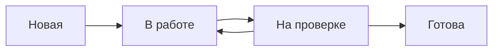

---
tags:
  - задачи
  - пользователю
---

# Задачи

Задача — базовая единица работы в TaskFlow. Из задач состоят проекты,
спринты и чек-листы.

## <a id="содержание">Содержание</a>

- [Создание задачи](#создание-задачи)
- [Статусы задач](#статусы-задач)
- [Канбан-доска](#канбан-доска)
- [Массовые операции](#массовые-операции)

## <a id="создание-задачи">Создание задачи</a>

1. Откройте проект.
2. Нажмите **Создать задачу**.
3. Заполните поля:

| Поле | Обязательное | Описание |
| --- | --- | --- |
| Название | Да | Краткое описание задачи |
| Описание | Нет | Подробности, критерии приёмки |
| Исполнитель | Нет | Кто будет делать |
| Срок | Нет | Дедлайн |
| Приоритет | Нет | Низкий, средний, высокий, критический |
| Теги | Нет | Метки для фильтрации |

4. Нажмите **Сохранить**.

## <a id="статусы-задач">Статусы задач</a>

Задача проходит по стандартному workflow:

Статус можно менять вручную или автоматически при переходе между колонками
на канбан-доске.

## <a id="канбан-доска">Канбан-доска</a>

Канбан-доска показывает задачи по колонкам — по одной на каждый статус.
Перетаскивайте карточки между колонками, чтобы менять статус.

!!! tip "Совет"
    Если задач больше 30, включите фильтр по исполнителю или тегу —
    доска станет читаемее.

## <a id="массовые-операции">Массовые операции</a>

Выделите несколько задач чекбоксами, чтобы:

- назначить исполнителя;
- изменить приоритет;
- добавить тег;
- переместить в другой проект;
- удалить.

--8<-- "warning-backup.md"
