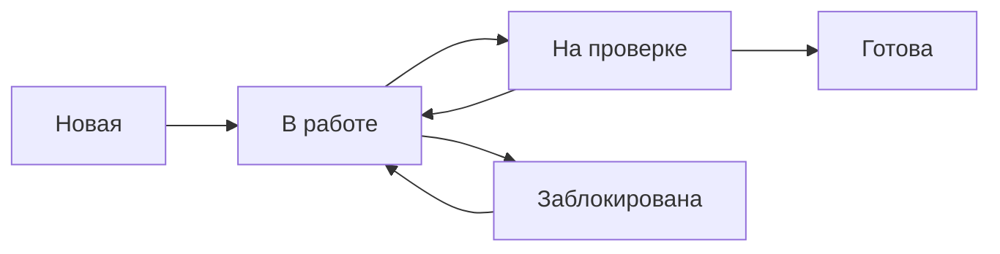

---
tags:
  - задачи
  - пользователю
---

# Задачи

Задача — базовая единица работы в TaskFlow. Из задач состоят проекты,
спринты и чек-листы.

## Содержание

- [Создание задачи](#создание-задачи)
- [Поля задачи](#поля-задачи)
- [Статусы и workflow](#статусы-и-workflow)
- [Канбан-доска](#канбан-доска)
- [Чек-листы внутри задачи](#чек-листы-внутри-задачи)
- [Связи между задачами](#связи-между-задачами)
- [Комментарии и вложения](#комментарии-и-вложения)
- [Фильтрация и поиск](#фильтрация-и-поиск)
- [Массовые операции](#массовые-операции)

## <a id="создание-задачи">Создание задачи</a>

Есть три способа создать задачу:

| Способ | Когда использовать |
| --- | --- |
| Через кнопку **Создать задачу** в проекте | Когда известны все параметры |
| Через `+` в колонке канбан-доски | Быстрое добавление в конкретный статус |
| Горячей клавишей `N` | Когда руки на клавиатуре |

Пошагово:

1. Откройте проект.
2. Нажмите **Создать задачу**.
3. Заполните поля (см. таблицу ниже).
4. Нажмите **Сохранить**.

## <a id="поля-задачи">Поля задачи</a>

| Поле | Обязательное | Описание |
| --- | --- | --- |
| Название | Да | Краткое описание, до 120 символов |
| Описание | Нет | Подробности, критерии приёмки, ссылки |
| Исполнитель | Нет | Один или несколько участников проекта |
| Срок | Нет | Дедлайн, отображается в календаре |
| Приоритет | Нет | Низкий, средний, высокий, критический |
| Теги | Нет | Метки для фильтрации и группировки |
| Оценка | Нет | Трудозатраты в часах или story points |
| Спринт | Нет | К какому спринту относится задача |

!!! tip "Соглашение по названиям"
    Формулируйте название как действие: «Настроить интеграцию со Slack»,
    а не «Интеграция со Slack». Так задача читается в списке и на доске.

## <a id="статусы-и-workflow">Статусы и workflow</a>

Задача проходит по стандартному workflow:



| Статус | Что означает | Кто меняет |
| --- | --- | --- |
| Новая | Задача создана, не взята в работу | Автор или менеджер |
| В работе | Исполнитель приступил | Исполнитель |
| На проверке | Ожидает ревью | Исполнитель |
| Готова | Проверена и завершена | Ревьюер |
| Заблокирована | Есть препятствие | Исполнитель |

Статус меняется автоматически при перетаскивании карточки между колонками
или вручную в карточке задачи.

## <a id="канбан-доска">Канбан-доска</a>

Канбан-доска — основное представление для ежедневной работы.

### Настройка колонок

По умолчанию четыре колонки. Можно добавить свои:

1. Откройте **Настройки проекта → Доска**.
2. Нажмите **Добавить колонку**.
3. Укажите название и статус, к которому она привязана.
4. Сохраните.

### Лимит задач в колонке

Чтобы ограничить количество задач «В работе» (принцип WIP-лимита):

1. Откройте **Настройки проекта → Доска**.
2. У колонки **В работе** укажите лимит, например `3`.
3. При превышении система подсветит колонку красным.

!!! tip "Совет"
    Если задач больше 30, включите фильтр по исполнителю или тегу —
    доска станет читаемее.

## <a id="чек-листы-внутри-задачи">Чек-листы внутри задачи</a>

Чек-лист помогает разбить большую задачу на подшаги.

Чтобы добавить чек-лист:

1. Откройте задачу.
2. Перейдите на вкладку **Чек-лист**.
3. Добавьте пункты.
4. Отмечайте выполненные галочкой.

Прогресс отображается на карточке задачи в виде полосы: `3/5`.

!!! note "Связь с дочерними задачами"
    Если подшагов больше десяти — создайте **дочерние задачи** вместо
    чек-листа. Так каждая получит своего исполнителя и срок.

## <a id="связи-между-задачами">Связи между задачами</a>

TaskFlow поддерживает четыре типа связей:

| Тип | Что означает |
| --- | --- |
| Блокирует | Задача A должна быть завершена до начала B |
| Заблокирована | Обратная связь от «блокирует» |
| Дублирует | Задачи описывают одно и то же |
| Связана с | Слабая связь для контекста |

Чтобы добавить связь:

1. Откройте задачу.
2. Вкладка **Связи** → **Добавить**.
3. Выберите тип и укажите вторую задачу.

## <a id="комментарии-и-вложения">Комментарии и вложения</a>

В карточке задачи можно:

- оставлять комментарии с упоминанием коллег через `@`;
- прикреплять файлы до 25 МБ;
- вставлять изображения из буфера обмена (`Ctrl+V`);
- ссылаться на другие задачи через `#` и номер.

!!! warning "Упоминания в комментариях"
    При упоминании `@` коллега получит уведомление. Не злоупотребляйте —
    уведомления отвлекают.

## <a id="фильтрация-и-поиск">Фильтрация и поиск</a>

### Быстрые фильтры

Над списком задач доступны фильтры:

- **Мои задачи** — назначенные на вас.
- **Просроченные** — срок прошёл, задача не завершена.
- **Без исполнителя** — задачи, которые никто не взял.
- **Высокий приоритет** — приоритет `Высокий` или `Критический`.

### Расширенный фильтр

Нажмите **Фильтр** → **Расширенный**. Можно комбинировать условия:

```
Приоритет = Критический
И Срок < через 3 дня
И Исполнитель = Иван Петров
```

### Поиск

Глобальный поиск по `/` ищет:

- по названию и описанию задач;
- по комментариям;
- по именам файлов во вложениях.

## <a id="массовые-операции">Массовые операции</a>

Выделите несколько задач чекбоксами, чтобы:

- назначить исполнителя;
- изменить приоритет;
- добавить или снять тег;
- переместить в другой проект или спринт;
- удалить;
- экспортировать в CSV.

!!! warning "Массовое удаление"
    Удалённые задачи попадают в корзину проекта и хранятся 30 дней.
    Восстановить можно из раздела **Корзина**.

--8<-- "warning-backup.md"
